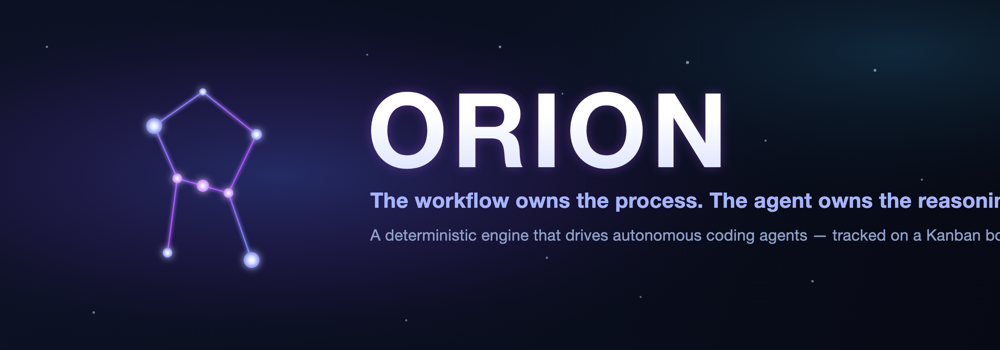
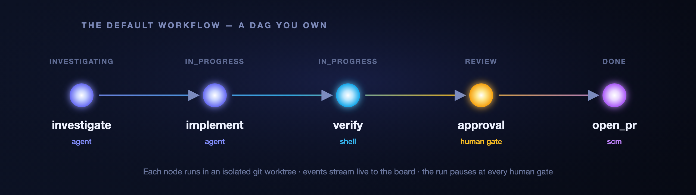
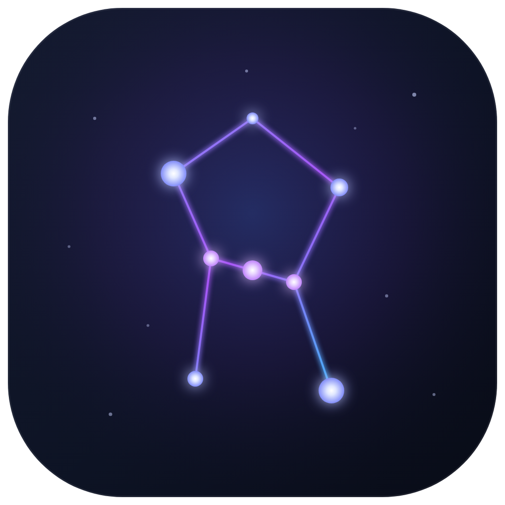

<div align="center">



<h3>The workflow owns the process. The agent owns the reasoning.</h3>

<p>
Orion is an <strong>AI workflow orchestrator</strong> for building software with autonomous agents.<br/>
Not a chat wrapper around a model — a <strong>deterministic engine</strong> that drives coding agents through a<br/>
DAG of steps you define, tracked live on a Kanban board.
</p>

<p>
  
  
  
  
  
</p>

</div>

---

When you ask an AI agent to "fix this bug," what actually happens depends on the model's mood. It might skip investigation. It might forget to run the tests. It might open a pull request nobody reviewed. Every run is different, and none of it is yours to control.

**Orion flips the script.** You encode your development process as a workflow — a directed graph of steps with dependencies, validation gates, and human approvals. A deterministic engine owns that process and schedules each step in order. The agent only supplies reasoning *inside* a step. The structure is repeatable, auditable, and owned by you.

> Think of the Orion constellation itself: a handful of bright stars, connected into a shape you recognize instantly. That's your workflow — a graph of nodes, wired together, that runs the same way every single time.

## Why Orion?

- **Deterministic by design** — The engine is a pure DAG scheduler. It handles ordering, dependencies, and approvals, and it *never* talks to a model directly. Same workflow, same sequence, every run.
- **Human-in-the-loop, first-class** — `approval` is a real node type. The run pauses, the ticket lands in your review column, and nothing proceeds until you click approve.
- **Isolated by default** — Every run executes in its own disposable git worktree. Run many tickets in parallel with zero conflicts; your working checkout is never touched.
- **Watch it think** — Every node transition, agent message, tool call, and log line is event-sourced and streamed live to the board over SSE. Open a ticket and watch the work happen.
- **Yours, in your repo** — Board columns, agents, and the whole workflow live in a single `.orion/config.yaml`, version-controlled next to your code. Your whole team runs the same process.
- **Provider-agnostic & pluggable** — Every integration — AI harness, source control, board, chat — sits behind a category adapter. Point the Codex harness at OpenAI, DeepSeek, or any OpenAI-compatible endpoint. Swap parts without touching the engine.
- **Multi-repo native** — A project can be one repo *or* a workspace folder of many. Agents run at the workspace level and open one pull request per changed repository.

## What It Looks Like

Define your process once. Here's the default workflow — investigate, implement, verify, get a human approval, then open the PR:

```yaml
# .orion/config.yaml
project:
  name: example-service
  defaultBranch: main

board:
  columns: [backlog, investigating, in_progress, review, done]

workflow:
  name: default
  nodes:
    - id: investigate
      type: agent                   # AI reasons, no code changes
      provider: codex               # harness adapter key
      model: gpt-5-codex
      # baseUrl: https://api.deepseek.com   # any OpenAI-compatible endpoint
      instructions: commands/investigate.md
      skills: [conventional-commits, pr-description]   # from the skill catalog
      command: commands/investigate.md
      column: investigating

    - id: implement
      type: agent
      provider: codex
      model: gpt-5-codex
      command: commands/implement.md
      dependsOn: [investigate]
      column: in_progress

    - id: verify
      type: shell                   # deterministic — no AI
      script: "npm test"
      dependsOn: [implement]
      column: in_progress

    - id: approval
      type: approval                # pauses for a human
      dependsOn: [verify]
      column: review

    - id: open_pr
      type: scm                     # commits, pushes, opens the PR
      action: open_pull_request
      dependsOn: [approval]
      column: done
```

<div align="center">

</div>

Then just work the board. Drop a ticket, assign an agent, and hit **Start Run**:

```text
Ticket #42  ·  "Fix flaky checkout total on empty cart"

  → worktree created on branch orion/ticket-42 …
  → investigate  · agent reading codebase, finding root cause …
  → implement    · editing cart.ts, adding a regression test …
  → verify       · npm test → 128 passing
  → approval     · ⏸ waiting for you in the Review column
        (you click Approve)
  → open_pr      · pushed & opened https://github.com/you/shop/pull/91
```

Every arrow above is a live event on the board. Nothing is a black box.

## Core Concepts

| Concept | What it is |
| --- | --- |
| **Project** | A repository *or* a folder of repositories. Its board, agents, and workflow come from `.orion/config.yaml` at the source root. Sources can be `remote` (a git URL Orion clones), `local` (an existing checkout), or `workspace` (a parent folder of many repos sharing one board). |
| **Ticket** | A unit of work on the board. An agent picks it up and runs the workflow. |
| **Workflow** | A DAG of nodes — `agent`, `shell`, `approval`, `scm`. The engine schedules each node as its dependencies complete and pauses on approvals. |
| **Run** | One execution of a workflow for a ticket, isolated in its own git worktree. Every step emits event-sourced events, streamed live to the board. |

**Four node types, one clean contract:**

- 🧠 `agent` — an AI turn, driven by a rendered command template. Streams messages and tool calls.
- ⚙️ `shell` — a deterministic script (`npm test`, a linter, a build). No AI.
- ✋ `approval` — a human gate. The run parks in your review column until you approve.
- 🔀 `scm` — source-control actions like `open_pull_request` (one PR per changed repo).

## Architecture

Everything integratable sits behind a category adapter interface, so new tools are purely additive — implement the interface, register it, and the engine and UI light up.

| Category | Interface (`*-core`) | In scope | On the roadmap |
| --- | --- | --- | --- |
| `harness` | `@orion/harness-core` | **codex** | claude, opencode |
| `scm` | `@orion/scm-core` | **github** | bitbucket, gitlab |
| `board` | `@orion/board-core` | **native** | jira, trello, linear |
| `communication` | `@orion/communication-core` | **webhook** (Slack/Discord-compatible) | slack, discord, telegram |

```
┌──────────────────────────────────────────────────────────────┐
│   Web (React + shadcn/ui Kanban)   ·   REST + SSE API          │
└───────────────────────────────┬──────────────────────────────┘
                                │
                                ▼
┌──────────────────────────────────────────────────────────────┐
│                   Orchestrator (Express)                       │
│     worktree isolation · event bus · node executors           │
└───────────────────────────────┬──────────────────────────────┘
                                │
                                ▼
┌──────────────────────────────────────────────────────────────┐
│           Workflow Engine — deterministic DAG scheduler        │
│              (no AI, no DB — pure ordering & gates)            │
└───────────────────────────────┬──────────────────────────────┘
                                │
        ┌───────────────┬───────┴───────┬────────────────┐
        ▼               ▼               ▼                ▼
  ┌──────────┐   ┌──────────┐    ┌──────────┐     ┌──────────┐
  │ harness  │   │   scm    │    │  board   │     │  comms   │
  │ (codex)  │   │ (github) │    │ (native) │     │ (future) │
  └──────────┘   └──────────┘    └──────────┘     └──────────┘
                                │
                                ▼
              PostgreSQL (Drizzle) — event-sourced runs
```

```
apps/
  orchestrator   Express: REST + SSE, hosts the engine and adapters
  web            React + shadcn/ui Kanban board (Vite)
packages/
  shared/models          domain types
  shared/adapter-kit     shared provider registry
  core/config            YAML + zod config loader, command templates, DAG validation
  core/workflow-engine   deterministic DAG scheduler (no AI, no DB)
  data/db                Drizzle schema, client, repositories, migrations
  adapters/<category>/*  category interfaces (core) and implementations
```

The Codex harness uses `@openai/codex-sdk` and can target OpenAI, DeepSeek, or any OpenAI-compatible endpoint via `baseUrl`.

## Getting Started

### Running with Docker (recommended)

`docker compose up` builds everything, applies database migrations, and serves the whole stack. Services bind to `0.0.0.0`, so other devices on your network can reach the board. Apps use the `8400–8410` port range.

```bash
cp .env.example .env   # optional: set CODEX_API_KEY / CODEX_BASE_URL / GITHUB_TOKEN
docker compose up -d --build
```

| Service | URL | Notes |
| --- | --- | --- |
| Web (board) | `http://<host>:8401` | nginx serves the UI and proxies `/api` |
| Orchestrator | `http://<host>:8400` | REST + SSE API |
| Postgres | `<host>:8402` | user/pass/db: `orion` |

The `migrate` service runs once on startup and exits; the orchestrator waits for it to finish. Because the web container proxies `/api` to the orchestrator, the board works from any device without rebuilds.

To use `local`/`workspace` projects with Docker, the orchestrator bind-mounts a host directory at the **same absolute path** inside the container (defaults to your home directory). Narrow it with `ORION_PROJECTS_DIR`:

```bash
ORION_PROJECTS_DIR=/Users/you/Documents/Development
```

Isolated worktrees are created under the managed volume, so your local checkouts are never modified in place.

```bash
docker compose logs -f orchestrator   # follow logs
docker compose down                    # stop (add -v to drop the database)
```

### Local development (without Docker)

1. Install dependencies and start Postgres:

   ```bash
   npm install
   docker compose up -d postgres
   cp .env.example .env
   npx nx run @orion/db:db:migrate
   ```

2. Run the orchestrator API and the board:

   ```bash
   npx nx serve @orion/orchestrator   # http://localhost:3333
   npx nx dev @orion/web              # http://localhost:4200
   ```

### Embedded database (no Postgres)

For a quick local try without Docker or a Postgres server, point `DATABASE_URL`
at [PGlite](https://pglite.dev) — real Postgres compiled to WASM, running
in-process:

```bash
DATABASE_URL=pglite://./pgdata npx nx serve @orion/orchestrator
```

The orchestrator creates the embedded database at that path (use `pglite://memory`
for an ephemeral in-memory database) and auto-applies the same migrations on boot,
so there are no manual setup steps. Because PGlite *is* Postgres, it reuses the
existing schema, migrations and repositories unchanged. Postgres remains the
default and is recommended for shared or production deployments.

## Configuring a Repository

Add `.orion/config.yaml` (and any command templates under `.orion/commands/`) to the repository a project tracks. See [`examples/orion-config`](./examples/orion-config) for a complete example.

Command templates are markdown files with `$VARIABLE` substitution — the engine renders them fresh for every node:

| Variable | Resolves to |
| --- | --- |
| `$ARGUMENTS` | The ticket title + description |
| `$TICKET_TITLE` | The ticket title |
| `$REPOSITORY` / `$REPOSITORIES` | The repo (or comma-separated repos for a workspace) |
| `$BRANCH` / `$BASE_BRANCH` | The run branch and its base |
| `$WORKFLOW_ID` | The workflow name |

Config is validated with Zod on load — unique node IDs, valid agent and column references, no dangling dependencies, and **cycle detection** so a bad graph never runs.

### Skills

Skills are reusable, self-contained instruction bundles — a folder with a `SKILL.md` (plus optional references and scripts) following the Claude/opencode convention. An agent opts into skills by name, and Orion **materializes** the selected skills into the run's isolated worktree (under `.orion/skills/`, indexed in `AGENTS.md`) so the harness discovers them natively.

```yaml
workflow:
  nodes:
    - id: implement
      type: agent
      provider: codex
      skills: [conventional-commits, test-driven-change]
```

The **skill catalog** for a project is the union of Orion's built-in defaults and any skills installed under `.orion/skills/`. Orion ships with `conventional-commits`, `test-driven-change`, and `pr-description` out of the box; a project skill of the same name overrides a built-in.

Install skills from a GitHub repository (recorded in `.orion/skills-lock.json` for reproducible checkouts) and browse the catalog over the API:

```bash
# List the catalog (built-in + installed).
GET  /api/projects/:id/skills

# Install a skill from a GitHub repo (owner/repo + path to the skill folder).
POST /api/projects/:id/skills   { "source": "owner/repo", "skillPath": "skills/my-skill", "ref": "main" }

# Remove an installed skill.
DELETE /api/projects/:id/skills/:name
```

A run fails fast with a clear error if an agent references a skill that is not in the catalog.

### Resilient nodes

Any workflow node can opt into retries and a timeout. A failed node is retried up to `retries` times (with an optional `retryDelayMs` pause) before the run fails, and a node that exceeds `timeoutMs` is aborted and treated as a failure (subject to the same retry policy):

```yaml
- id: verify
  type: shell
  script: "npm test"
  retries: 2          # up to 2 extra attempts after the first failure
  retryDelayMs: 5000  # wait 5s between attempts
  timeoutMs: 600000   # abort and fail if it runs longer than 10 minutes
```

Advisory steps can opt out of failing the run with `continueOnError`. The node is
marked `skipped` if it fails (after exhausting any retries), the failure is
recorded on the timeline, and dependents still proceed — perfect for
non-blocking gates like an advisory linter:

```yaml
- id: lint
  type: shell
  script: "npm run lint"
  continueOnError: true   # a failing lint won't block the PR
```

### Parallel fan-out

The engine schedules the DAG, not a list. Every node whose dependencies are
satisfied in the same pass runs **concurrently**, so independent branches (say
`lint`, `typecheck` and `test`) execute in parallel and the run only advances
once they all settle.

### Retrying & crash recovery

A failed or cancelled run can be retried from the board — it resumes from the
last successful node, preserving completed work and re-running everything else in
a fresh worktree (`POST /api/runs/:id/retry`). And because runs are
event-sourced, a run left mid-flight by an orchestrator restart is automatically
surfaced as failed on startup so you can retry it, instead of hanging forever.

### Bounded concurrency

`ORION_MAX_CONCURRENT_RUNS` (default `3`, `0` = unlimited) caps how many runs
execute at once. Start as many tickets as you like — anything over the limit is
`queued` and launched automatically as slots free up.

### Notifications

Set `ORION_NOTIFY_WEBHOOK_URL` to POST run lifecycle notifications — *approval needed*, *completed*, and *failed* — to a Slack- or Discord-compatible incoming webhook. The payload includes a ready-to-render `text`/`content` string plus the structured `title`, `body`, `level`, and `url` fields for custom consumers.

## Common Tasks

```bash
npx nx run-many -t typecheck lint test   # verify the workspace
npx nx run @orion/db:db:generate         # regenerate migrations after schema changes
```

## Roadmap

- **Harnesses** — Claude, opencode alongside Codex
- **Source control** — GitLab, Bitbucket
- **Boards** — sync with Jira, Trello, Linear
- **Communication** — Slack, Discord, Telegram notifications on approvals and completions

New providers are additive: implement a category interface, register it, done.

## License

[MIT](./LICENSE)

<div align="center">
<br/>

<br/>
<sub><strong>Orion</strong> — the workflow owns the process, the agent owns the reasoning.</sub>
</div>
